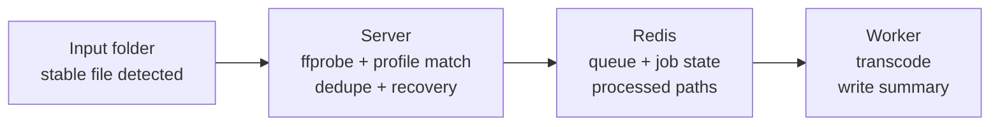

# vshift

Automatic FFmpeg-based video transcoder with Redis-backed orchestration, rule-based profile matching, and multi-mode deployment.

vshift watches an input directory, matches incoming media files to transcoding profiles, enqueues jobs in Redis, and processes them on dedicated worker processes. A minimal REST API exposes health checks and job status. The server handles scanning, deduplication, stale-job recovery, and—optionally—Kubernetes worker scaling.

---

## Features

- **Rule-based profile matching** — map files by extension, resolution, and filename glob to transcoding profiles
- **Native YAML profiles** — H.264/H.265/AV1, audio tracks, subtitles, quality modes; optional HandBrake preset import
- **Hardware encoder auto-detection** — NVENC, QSV, VAAPI, VideoToolbox via FFmpeg encoder discovery
- **Crash-safe orchestration** — Redis job state, heartbeats, configurable retries, dead-letter queue
- **Deduplication** — each input path is processed at most once (persisted in Redis)
- **REST API** — health, job listing, job detail, and transcoding summaries (OpenAPI/Swagger)
- **Flexible deployment** — local development, Docker Compose, or Kubernetes with dynamic worker Job pods
- **Clean Architecture** — strict typing (Pyright), ports/adapters, single-responsibility use cases

---

## How It Works



1. The **server** periodically scans the input directory and waits until files are stable (fully copied).
2. Each candidate file is probed with `ffprobe`, matched against configured rules, and enqueued as a `TranscodeJob`.
3. **Workers** pull jobs from the Redis queue, run FFmpeg, atomically write output, and emit a JSON summary (`{output_stem}.summary.json`).
4. If a worker crashes, the server detects expired heartbeats and requeues or dead-letters the job based on retry limits.

For a full design reference, see [`docs/ARCHITECTURE.md`](docs/ARCHITECTURE.md).

---

## Requirements

| Component | Version |
| --------- | ------- |
| Python    | 3.13+   |
| FFmpeg    | with `ffmpeg` and `ffprobe` on `PATH` |
| Redis     | external instance (required in all deployment modes) |
| [uv](https://docs.astral.sh/uv/) | dependency management |

Optional:

- [just](https://github.com/casey/just) — development task shortcuts
- Kubernetes cluster + Helm 3 — for dynamic worker pods

---

## Quick Start (Docker Compose)

The fastest way to run vshift locally:

```bash
# Copy and adjust configuration
cp config/vshift.example.yaml config/vshift.yaml
cp .env.example .env

# Create data directories referenced by the config
mkdir -p data/input data/output data/temp

# Start Redis, server (API + orchestration), and workers
docker compose up --build
```

| Service | Purpose | Port |
| ------- | ------- | ---- |
| `redis` | Job queue and state | 6379 |
| `server` | REST API, input scan, recovery | 8000 |
| `worker` | FFmpeg transcoding (2 replicas) | — |

Open the API documentation at [http://localhost:8000/docs](http://localhost:8000/docs).

Drop a video file into `data/input/` and watch jobs appear via `GET /jobs`.

---

## Configuration

vshift uses two configuration layers:

1. **YAML config** (`config/vshift.yaml`) — profiles, match rules, directories, and behavior
2. **Environment variables** (prefix `VSHIFT__`, nested with `__`) — runtime settings, Redis, API, Kubernetes

### YAML config

Start from the example:

```bash
cp config/vshift.example.yaml config/vshift.yaml
```

Key sections:

| Section | Purpose |
| ------- | ------- |
| `behavior` | `no_match`, `input_after_success`, `file_stability_seconds`, `max_retries` |
| `directories` | `input`, `output`, `temp` paths (must be shared between server and workers) |
| `profiles` | Named transcoding profiles (inline or `$ref: profiles/…`) |
| `rules` | Priority-ordered match rules → profile name |

Example rule:

```yaml
rules:
  - id: movies_1080p
    priority: 10
    match:
      extensions: [mkv, mp4]
      min_width: 1280
      max_width: 1920
      filename_glob: "*.mkv"
    profile: h264_1080p
```

### Environment variables

Copy `.env.example` and set at minimum the Redis password:

```bash
cp .env.example .env
```

| Variable | Default | Description |
| -------- | ------- | ----------- |
| `VSHIFT__REDIS__PASSWORD` | *(required)* | Redis authentication |
| `VSHIFT__REDIS__HOST` | `localhost` | Redis hostname |
| `VSHIFT__REDIS__PORT` | `6379` | Redis port |
| `VSHIFT__CONFIG__FILE` | `config/vshift.yaml` | Path to YAML config |
| `VSHIFT__API__PORT` | `8000` | REST API port |
| `VSHIFT__SERVER__SCAN_INTERVAL_SECONDS` | `30` | Input scan interval |
| `VSHIFT__WORKER__ONE_SHOT` | `false` | Exit after one job (K8s Job pods) |
| `VSHIFT__KUBERNETES__ENABLED` | `false` | Enable dynamic worker pod scaling |

See [`src/vshift/application/common/settings.py`](src/vshift/application/common/settings.py) for the full settings schema.

---

## REST API

The server exposes a minimal monitoring API (no authentication in v1):

| Method | Path | Description |
| ------ | ---- | ----------- |
| `GET` | `/health` | Service status and Redis connectivity |
| `GET` | `/jobs` | List jobs (`state`, `limit`, `offset` query params) |
| `GET` | `/jobs/{id}` | Single job with state, timestamps, and errors |
| `GET` | `/jobs/{id}/summary` | Transcoding statistics for completed jobs |

Documentation endpoints (enabled by default):

- Swagger UI — `/docs`
- ReDoc — `/redoc`
- OpenAPI schema — `/openapi.json`

---

## Deployment

### Local development

Run Redis externally, then start server and worker in separate terminals:

```bash
uv sync
export VSHIFT__REDIS__PASSWORD=changeme

uv run vshift-server    # API + background scan/recovery
uv run vshift-worker    # transcode loop
```

Scale workers by launching additional `vshift-worker` processes.

### Docker

Build the image:

```bash
docker build -t ghcr.io/bueckerlars/vshift:latest .
```

Release images are published to `ghcr.io/bueckerlars/vshift` when a Git tag is pushed.

Pull a release image:

```bash
docker pull ghcr.io/bueckerlars/vshift:latest
```

GHCR packages are **private by default** (same as findus). After the first release, set the package to **Public** once under [Package settings](https://github.com/users/bueckerlars/packages/container/vshift/settings) → Danger Zone → Change visibility. Until then, authenticate before pulling:

```bash
echo "$GITHUB_TOKEN" | docker login ghcr.io -u bueckerlars --password-stdin
docker pull ghcr.io/bueckerlars/vshift:latest
```

The image includes FFmpeg and exposes port `8000`. Entry points:

- `vshift-server` — default `CMD`
- `vshift-worker` — override `command` in Compose or Kubernetes

Shared volumes for input, output, temp, and config are required so server and workers see the same paths.

### Kubernetes (Helm)

A Helm chart is provided under `helm/vshift/`:

```bash
helm install vshift ./helm/vshift \
  --set redis.host=redis.example.com \
  --set redis.password=secret
```

**Default worker mode: dynamic.** When `worker.dynamic.enabled` is true, the server creates Kubernetes Job pods (`vshift-worker` with `one_shot=true`) based on queue depth, up to `maxConcurrentPods`. Static worker Deployments are optional via `worker.static.enabled`.

The chart includes:

- Server Deployment + Service + RBAC (Job pod creation)
- ConfigMap for `vshift.yaml`
- PVCs for input/output/temp (or existing claims)
- Optional static worker Deployment

Port-forward the API after install:

```bash
kubectl port-forward svc/vshift-server 8000:8000
open http://localhost:8000/docs
```

Redis is always external—no embedded Redis in any deployment mode.

---

## Development

### Install

With [just](https://github.com/casey/just):

```bash
just install
```

Manual equivalent:

```bash
uv sync --all-extras --all-groups
uv run prek install
```

This creates `.venv`, installs dev dependencies (pytest, pyright, ruff, prek), and registers pre-commit hooks.

### Linting and type checking

```bash
uv run ruff check src tests
uv run ruff format src tests
uv run pyright
```

### Pre-commit hooks

```bash
uv run prek run              # staged files
uv run prek run --all-files  # entire repo
```

### Tests

```bash
uv run pytest
```

The suite covers domain models, Redis stores, FFmpeg integration, server/worker use cases, REST API, YAML config loading, and Kubernetes pod factory logic.

---

## Project Structure

```
src/vshift/
├── domain/              # Entities, value objects, business rules (no I/O)
├── ports/               # Protocol interfaces (JobRepository, TaskQueue, …)
├── application/         # Use cases and entry points
│   ├── server/          # Scan, enqueue, recovery, K8s scaling
│   └── worker/          # Claim, transcode, summary, failure handling
└── infrastructure/      # Adapters
    ├── api/             # FastAPI app, routers, schemas
    ├── redis/           # Job store, queue, worker registry
    ├── ffmpeg/          # Probe, encode, encoder resolution
    ├── filesystem/      # YAML config, file scanner
    ├── kubernetes/      # Dynamic worker Job pods
    └── handbrake/       # HandBrake preset import

config/                  # vshift YAML configuration
helm/vshift/             # Kubernetes Helm chart
tests/                   # Pytest suite
docs/ARCHITECTURE.md     # Detailed design document
```

---

## Production Install

Install runtime dependencies only (locked):

```bash
uv sync --locked
uv run vshift-server
```

Or install into the active environment:

```bash
uv sync --locked
uv pip install -e .
vshift-server
vshift-worker
```

---

## Roadmap

| Area | Status |
| ---- | ------ |
| Domain models & profiles | Done |
| Redis orchestration | Done |
| FFmpeg pipeline | Done |
| Server & worker use cases | Done |
| REST API & Docker | Done |
| Kubernetes dynamic workers & Helm | Done |
| Prometheus metrics | Planned |

---

## License

No license file has been added yet. All rights reserved unless otherwise specified by the repository owner.
