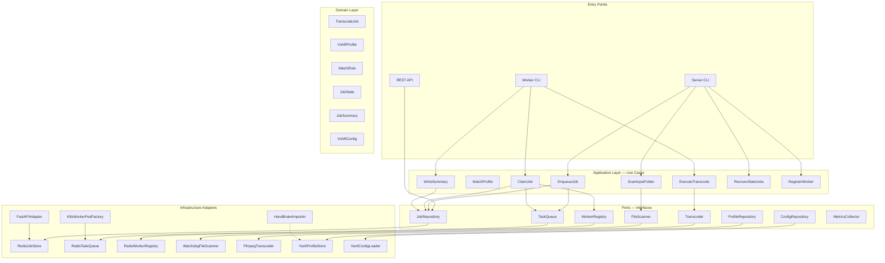
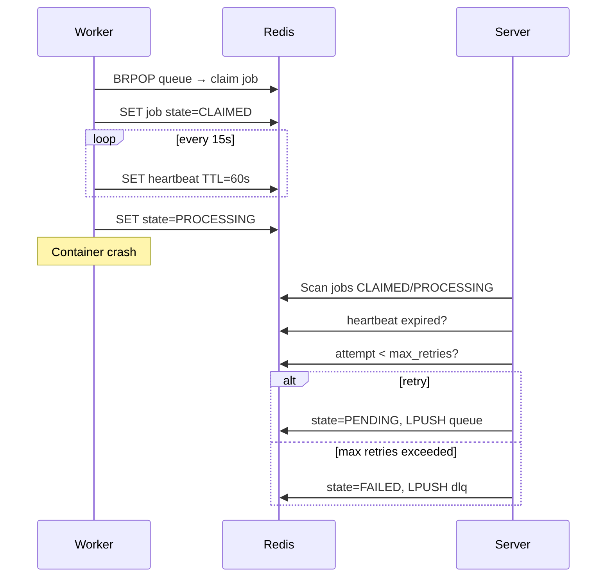

# vshift — Architecture & Design Document

> Version: 0.1 · Status: Draft · Last updated: 2026-06-03

Automatic FFmpeg-based video transcoder with Redis-backed orchestration, configurable profile matching, and multi-mode deployment (single container, Docker Compose, Kubernetes).

---

## Table of Contents

1. [Current State](#1-current-state)
2. [Goals & Non-Goals](#2-goals--non-goals)
3. [Decisions](#3-decisions)
4. [Architecture Overview](#4-architecture-overview)
5. [Package Structure](#5-package-structure)
6. [Domain Models](#6-domain-models)
7. [Configuration](#7-configuration)
8. [Use Cases](#8-use-cases)
9. [FFmpeg Integration](#9-ffmpeg-integration)
10. [Redis Data Model](#10-redis-data-model)
11. [Worker Registration & Discovery](#11-worker-registration--discovery)
12. [REST API](#12-rest-api)
13. [Deployment](#13-deployment)
14. [Design Patterns](#14-design-patterns)
15. [Logging](#15-logging)
16. [Typing & Quality](#16-typing--quality)
17. [Metrics (Future)](#17-metrics-future)
18. [Implementation Roadmap](#18-implementation-roadmap)
19. [Getting Started](#19-getting-started)

---

## 1. Current State

The project is in an early stage. Already implemented:


| Area                 | Status         | Files                                                                 |
| -------------------- | -------------- | --------------------------------------------------------------------- |
| **Domain models**    | Mature         | `VshiftProfile`, `VideoProfile`, `AudioTrack`, `SubtitleTrack`, enums |
| **HandBrake import** | Done (Adapter) | `HandBrakeImporter` — maps HandBrake presets → native profiles        |
| **Settings**         | Skeleton       | Redis, directories, logging via Pydantic Settings                     |
| **Server / Worker**  | Stubs          | `main.py` logs settings only                                          |
| **Queue**            | Skeleton       | `TranscodingQueue` — Redis client, no logic                           |
| **Tests**            | Profile/import | `test_transcoding_profile.py`                                         |
| **Tooling**          | Basic          | Python 3.13, uv, Ruff, Pyright (`standard`, target: `strict`)         |


**Conclusion:** The transcoding profile domain model is solid. Orchestration, FFmpeg integration, config matching, and deployment are the next focus areas.

---

## 2. Goals & Non-Goals

### Goals

- Automatic transcoding when new files appear in the input folder
- Configurable mapping: **input criteria → profile**
- Server orchestrates, worker executes — crash-safe via Redis state
- Three deployment modes (single container, Compose, Kubernetes)
- Clean Architecture, SRP, design patterns, strict typing
- Health and job status endpoints
- JSON summary file per completed job

### Non-Goals (v1)

- Web UI
- Live streaming transcoding
- Multi-tenant authentication
- Prometheus metrics (architecture prepared, not implemented)

---

## 3. Decisions

All previously open questions have been resolved:


| #   | Topic                     | Decision                                                                     |
| --- | ------------------------- | ---------------------------------------------------------------------------- |
| 1   | **Match criteria**        | `extensions`, `resolution` (min/max width/height), `filename` (glob/pattern) |
| 2   | **Profile sources**       | Native YAML + HandBrake import; native YAML is sufficient to start           |
| 3   | **No match**              | Configurable: `ignore` · `reject` · `default_profile`                        |
| 4   | **Input after success**   | Configurable: `keep` · `delete` · `move` (+ target directory)                |
| 5   | **Deduplication**         | Once per file (path-based, persisted in Redis)                               |
| 6   | **File stability**        | Configurable wait time before a file is considered fully copied              |
| 7   | **Hardware acceleration** | NVENC, QSV, VAAPI, VideoToolbox — auto-detection + profile override          |
| 8   | **Concurrency**           | One job per worker process                                                   |
| 9   | **Retries**               | Default 3, configurable                                                      |
| 10  | **K8s storage**           | NFS or PVC                                                                   |
| 11  | **Redis**                 | Always external — no embedded Redis in any deployment                        |
| 12  | **K8s workers**           | Default: dynamic job pods; static workers optional                           |
| 13  | **API**                   | Health + job status (minimal REST)                                           |
| 14  | **Summary**               | JSON: `{output_stem}.summary.json` in the output folder                      |
| 15  | **Metrics**               | Not in v1; architecture prepared via port/interface                          |


---

## 4. Architecture Overview

Clean Architecture with clear layer separation and the dependency rule (*dependencies always point inward*):




### Layer Responsibilities


| Layer              | Responsibility                          | External Dependencies        |
| ------------------ | --------------------------------------- | ---------------------------- |
| **Domain**         | Entities, value objects, business rules | None                         |
| **Application**    | Use cases, orchestration                | Domain + Ports only          |
| **Ports**          | Abstract interfaces (`Protocol`)        | Domain types                 |
| **Infrastructure** | Redis, FFmpeg, filesystem, API, K8s     | Third-party libraries        |
| **Entry Points**   | Server/Worker CLI, API server           | Application + Infrastructure |


---

## 5. Package Structure

```
src/vshift/
├── domain/                          # No external dependencies
│   ├── config/
│   │   ├── vshift_config.py         # Root config (rules + profile refs)
│   │   └── match_rule.py            # Input criteria → profile name
│   ├── job/
│   │   ├── transcode_job.py         # Entity: job with ID, state, payload
│   │   ├── job_state.py             # Enum + state machine
│   │   └── job_summary.py           # Value object for statistics
│   └── transcoding_profile/         # Profile models (existing code)
│       ├── vshift_profile.py
│       └── enums.py
│
├── application/                     # Use cases (orchestration)
│   ├── common/
│   │   ├── application_context.py   # DI container (composition root)
│   │   └── settings.py
│   ├── server/
│   │   ├── main.py
│   │   ├── settings.py
│   │   └── use_cases/
│   │       ├── scan_input.py
│   │       ├── enqueue_job.py
│   │       └── recover_stale_jobs.py
│   └── worker/
│       ├── main.py
│       ├── settings.py
│       └── use_cases/
│           ├── claim_job.py
│           ├── execute_transcode.py
│           └── write_summary.py
│
├── ports/                           # Abstract interfaces (Protocols)
│   ├── job_repository.py
│   ├── task_queue.py
│   ├── worker_registry.py
│   ├── file_scanner.py
│   ├── transcoder.py
│   ├── profile_repository.py
│   ├── config_repository.py
│   └── metrics_collector.py
│
├── infrastructure/                  # Concrete adapters
│   ├── redis/
│   │   ├── job_store.py
│   │   ├── task_queue.py
│   │   └── worker_registry.py
│   ├── filesystem/
│   │   ├── watchdog_scanner.py
│   │   └── yaml_config_loader.py
│   ├── ffmpeg/
│   │   ├── command_builder.py
│   │   ├── profile_mapper.py
│   │   ├── encoder_resolver.py
│   │   └── transcoder.py
│   ├── handbrake/
│   │   └── importer.py
│   └── api/
│       └── fastapi_app.py
│
├── exception.py
└── __init__.py
```

> **Note:** Existing `models/` and `data/` packages will be migrated into `domain/` and `infrastructure/` respectively.

---

## 6. Domain Models

### 6.1 TranscodeJob (Entity)

```python
class TranscodeJob(BaseModel):
    id: UUID                          # Survives restarts
    input_path: Path
    output_path: Path
    profile_name: str
    profile_snapshot: VshiftProfile   # Frozen profile at enqueue time
    state: JobState
    worker_id: str | None
    created_at: datetime
    claimed_at: datetime | None
    started_at: datetime | None
    completed_at: datetime | None
    attempt: int                      # Retry counter
    error_message: str | None
    match_rule_id: str                # Which rule matched
```

**Pattern:** *Memento* — `profile_snapshot` freezes the profile version at enqueue time so config changes do not affect running jobs.

### 6.2 JobState (State Pattern)

```
                    ┌──────────┐
         enqueue    │ PENDING  │
         ──────────►│          │
                    └────┬─────┘
                         │ claim
                         ▼
                    ┌──────────┐     timeout/crash
         start      │ CLAIMED  │◄──────────────────┐
         ──────────►│          │                   │
                    └────┬─────┘                   │
                         │ begin transcode         │ recover_stale
                         ▼                         │
                    ┌──────────┐                   │
                    │PROCESSING│───────────────────┘
                    └────┬─────┘
              success  │  failure (max retries)
                         ▼
              ┌──────────┴──────────┐
              ▼                     ▼
         ┌─────────┐          ┌─────────┐
         │COMPLETED│          │ FAILED  │
         └─────────┘          └─────────┘
```

Valid transitions are encapsulated in `JobStateMachine`.

### 6.3 JobSummary (Value Object)

```python
class JobSummary(BaseModel):
    job_id: UUID
    input_path: Path
    output_path: Path
    profile_name: str
    input_size_bytes: int
    output_size_bytes: int
    input_duration_seconds: float | None
    compression_ratio: float | None
    wall_clock_seconds: float
    ffmpeg_version: str
    started_at: datetime
    completed_at: datetime
    video_codec_in: str | None
    video_codec_out: str
    resolution_in: str | None
    resolution_out: str | None
```

Written as `{output_stem}.summary.json` next to the output file.

**Example:**

```
Input:   /data/input/movie.mkv
Output:  /data/output/movie.mp4
Summary: /data/output/movie.summary.json
```

### 6.4 MatchRule

Rules are evaluated in priority order. First matching rule wins.

**Pattern:** *Chain of Responsibility*

Supported criteria (v1):

- `extensions` — file extension list
- `min_width` / `max_width` / `min_height` / `max_height` — resolution bounds
- `filename_glob` — glob pattern against filename

Resolution is obtained via `ffprobe` during matching.

---

## 7. Configuration

### 7.1 Example Config

```yaml
version: "1"

behavior:
  no_match: ignore              # ignore | reject | default_profile
  default_profile: h264_1080p   # required when no_match: default_profile
  input_after_success: keep     # keep | delete | move
  input_move_dir: /data/processed
  file_stability_seconds: 10
  max_retries: 3

directories:
  input: /data/input
  output: /data/output
  temp: /data/temp

profiles:
  h264_1080p:
    name: "H.264 1080p"
    format: mp4
    video:
      codec: h264
      encoder: auto             # auto | libx264 | h264_nvenc | h264_qsv | ...
      quality_mode: constant
      quality: 22.0
      width: 1920
      height: 1080
    audio_tracks:
      - codec: aac
        bit_rate: 160
        mixdown: stereo

rules:
  - id: movies_1080p
    priority: 10
    match:
      extensions: [mkv, mp4]
      min_width: 1280
      max_width: 1920
      filename_glob: "*.mkv"
    profile: h264_1080p

  - id: small_files
    priority: 20
    match:
      extensions: [mp4]
      max_width: 1280
      filename_glob: "*"
    profile: h264_720p
```

### 7.2 Behavior Settings


| Setting                  | Options                               | Description                                      |
| ------------------------ | ------------------------------------- | ------------------------------------------------ |
| `no_match`               | `ignore`, `reject`, `default_profile` | Action when no rule matches                      |
| `input_after_success`    | `keep`, `delete`, `move`              | Input file handling after successful transcode   |
| `file_stability_seconds` | integer                               | Wait time before treating a file as fully copied |
| `max_retries`            | integer (default: 3)                  | Retry attempts on FFmpeg failure                 |


### 7.3 Profile Sources

- **Native YAML** — inline in config or `$ref: profiles/h264.yaml`
- **HandBrake import** — via `HandBrakeImporter` adapter (optional at runtime)

Native YAML is sufficient for the initial implementation.

### 7.4 Hardware Encoder Selection

```python
class VideoEncoder(StrEnum):
    AUTO = "auto"
    # Software
    LIBX264 = "libx264"
    LIBX265 = "libx265"
    LIBSVTAV1 = "libsvtav1"
    # NVIDIA
    H264_NVENC = "h264_nvenc"
    HEVC_NVENC = "hevc_nvenc"
    AV1_NVENC = "av1_nvenc"
    # Intel QSV
    H264_QSV = "h264_qsv"
    HEVC_QSV = "hevc_qsv"
    # VAAPI (Linux)
    H264_VAAPI = "h264_vaapi"
    HEVC_VAAPI = "hevc_vaapi"
    # Apple
    H264_VIDEOTOOLBOX = "h264_videotoolbox"
    HEVC_VIDEOTOOLBOX = "hevc_videotoolbox"
```

**Pattern:** *Strategy* — `EncoderResolver` detects available FFmpeg encoders when set to `auto` and selects the best match for the target codec. Profiles can override with an explicit encoder.

---

## 8. Use Cases

Each use case is a single class with one `execute()` method — **SRP**.


| Use Case           | Responsibility                               | Trigger               |
| ------------------ | -------------------------------------------- | --------------------- |
| `ScanInputFolder`  | Detect new/stable files                      | Server (watcher/poll) |
| `ProbeInputFile`   | Read ffprobe metadata (resolution, duration) | ScanInputFolder       |
| `MatchProfile`     | Resolve rule → profile                       | ScanInputFolder       |
| `EnqueueJob`       | Create job in Redis + push to queue          | ScanInputFolder       |
| `RecoverStaleJobs` | Reset CLAIMED/PROCESSING without heartbeat   | Server (periodic)     |
| `RegisterWorker`   | Register worker in registry                  | Worker (startup)      |
| `ClaimJob`         | BRPOP + transition to CLAIMED                | Worker (loop)         |
| `ExecuteTranscode` | Run FFmpeg, transition to PROCESSING         | Worker                |
| `WriteSummary`     | Write statistics, transition to COMPLETED    | Worker                |
| `HandleJobFailure` | Retry or mark FAILED                         | Worker                |


### User Story Mapping


| Story                        | Flow                                                                                   |
| ---------------------------- | -------------------------------------------------------------------------------------- |
| **1 — Config with profiles** | `YamlConfigLoader` loads `VshiftConfig`, validates profiles via Pydantic               |
| **2 — File → transcode**     | `ScanInputFolder` → `ProbeInputFile` → `MatchProfile` → `EnqueueJob` → worker pipeline |
| **3 — Summary**              | `WriteSummary` after successful `ExecuteTranscode`                                     |


### Matching Flow

```
File detected (stable)
  → ffprobe for resolution (width/height) + duration
  → MatchRule checks: extension + resolution + filename_glob
  → First matching rule (by priority) wins
  → No match → behavior.no_match action
  → Already processed (Redis key exists) → skip
```

---

## 9. FFmpeg Integration

### 9.1 Layers

```
VshiftProfile
    │
    ▼  ProfileMapper (Strategy)
FfmpegCommandSpec (intermediate model)
    │
    ▼  EncoderResolver (Strategy, if encoder=auto)
    │
    ▼  FfmpegCommandBuilder (Builder)
list[str]  # argv for subprocess
    │
    ▼  FfmpegTranscoder (Facade)
TranscodeResult
```

### 9.2 Pipeline

1. **Probe** — `ffprobe -json` for input metadata (matching + summary)
2. **Resolve encoder** — `EncoderResolver` picks HW/SW encoder
3. **Map** — `ProfileMapper` translates `VshiftProfile` → FFmpeg arguments
4. **Build** — `FfmpegCommandBuilder` constructs safe argv list (no shell string)
5. **Execute** — subprocess with progress parsing (`-progress pipe:1`)
6. **Atomic write** — output to `{temp}/{job_id}.partial`, then `rename()` to output dir

**Pattern:** *Template Method* — abstract pipeline `probe → build → execute → finalize`.

---

## 10. Redis Data Model

Redis is **always external**. No embedded Redis in any deployment mode.

### 10.1 Keys


| Key                             | Type   | Content                         | TTL                        |
| ------------------------------- | ------ | ------------------------------- | -------------------------- |
| `vshift:queue:pending`          | LIST   | Job IDs (FIFO)                  | —                          |
| `vshift:job:{id}`               | JSON   | Serialized `TranscodeJob`       | configurable (`queue.ttl`) |
| `vshift:job:{id}:heartbeat`     | STRING | Worker ID + timestamp           | 60s (renewed)              |
| `vshift:workers:{id}`           | HASH   | Capabilities, last_seen, status | 30s                        |
| `vshift:processed:{input_path}` | STRING | Job ID (deduplication)          | permanent (default)        |
| `vshift:dlq`                    | LIST   | Failed job IDs                  | —                          |


### 10.2 Crash Recovery




**Pattern:** *Command* — `TranscodeJob` is the serializable command object in the queue.

### 10.3 Deduplication

```
Redis: vshift:processed:{canonical_input_path} → job_id
```

- On enqueue: if key exists → skip (log at DEBUG level)
- Default TTL: none (permanent)
- Same file is never re-transcoded, even if mtime/size changes

---

## 11. Worker Registration & Discovery

### 11.1 Docker Compose

```
┌─────────────┐     heartbeat    ┌─────────────┐
│   Server    │◄─────────────────│  Worker N   │
│  (1 inst.)  │                  └─────────────┘
└──────┬──────┘     register           ▲
       │                               │
       ▼                               │
┌─────────────┐     BRPOP         ┌────┴────────┐
│    Redis    │◄──────────────────│  Worker 1   │
│  (external) │                   └─────────────┘
└─────────────┘
```

- Worker starts → `RegisterWorker` writes `vshift:workers:{hostname}:{pid}` with TTL
- Workers pull from queue — no explicit server-side registration required
- Compose: scale worker service with `deploy.replicas`

### 11.2 Kubernetes

**Default: Dynamic Job Pods**

```
Server detects queue depth > 0
    → creates K8s Job (via kubernetes Python client)
    → Job pod: vshift worker --one-shot
    → Pod terminates after completion
    → Server respects max_concurrent_job_pods
```

**Optional: Static Worker Deployment**

```yaml
replicas: 3
# Worker pods run continuously, pull from Redis
```

**Pattern:** *Factory Method* — `K8sWorkerPodFactory` creates Job specs.

---

## 12. REST API

Minimal REST API hosted by the server (FastAPI adapter in infrastructure layer).


| Method | Path                 | Description                                             |
| ------ | -------------------- | ------------------------------------------------------- |
| `GET`  | `/health`            | `{ "status": "ok", "redis": "ok", "version": "0.1.0" }` |
| `GET`  | `/jobs`              | List jobs (filter: state, limit, offset)                |
| `GET`  | `/jobs/{id}`         | Single job with state, timestamps, error                |
| `GET`  | `/jobs/{id}/summary` | JobSummary JSON (when completed)                        |


No authentication in v1.

---

## 13. Deployment

### 13.1 Single Container

```
┌──────────────────────────────────────┐
│  vshift-all-in-one                   │
│  ┌────────┐ ┌─────────┐             │
│  │ Server │ │ Worker  │             │
│  │ + API  │ │ (×1)    │             │
│  └────────┘ └─────────┘             │
│  Volumes: /data/input, /data/output │
│  Env: VSHIFT__REDIS__HOST=...       │
└──────────────────────────────────────┘
```

Server + worker in one image. Redis is always external.

### 13.2 Docker Compose

```yaml
services:
  redis:
    image: redis:7-alpine
    # Or use external managed Redis — set REDIS_HOST accordingly

  server:
    image: ghcr.io/bueckerlars/vshift:latest
    command: vshift-server
    volumes: [./data:/data, ./config:/config]
    environment:
      VSHIFT__REDIS__HOST: redis

  worker:
    image: ghcr.io/bueckerlars/vshift:latest
    command: vshift-worker
    deploy:
      replicas: 3
    volumes: [./data:/data, ./config:/config]
    environment:
      VSHIFT__REDIS__HOST: redis
```

Shared volume for input/output/temp is required — server and workers must see the same paths.

### 13.3 Kubernetes + Helm

```
helm/vshift/
├── Chart.yaml
├── values.yaml
├── templates/
│   ├── server-deployment.yaml
│   ├── worker-job-template.yaml    # dynamic pods (default)
│   ├── worker-deployment.yaml      # optional static workers
│   ├── pvc.yaml
│   ├── configmap.yaml
│   ├── rbac.yaml                   # for dynamic job pod creation
│   └── servicemonitor.yaml         # future: Prometheus
```

**values.yaml highlights:**

```yaml
worker:
  mode: dynamic                   # dynamic | static | both
  dynamic:
    enabled: true
    maxConcurrentPods: 1
    resources:
      requests: { cpu: "1500m", memory: "3Gi" }
      limits: { cpu: "3", memory: "5Gi" }
  static:
    replicas: 0                   # disabled by default

redis:
  externalUrl: "redis://redis.example.com:6379"

storage:
  input:
    existingClaim: media-input-pvc
  output:
    existingClaim: media-output-pvc
```

Storage via NFS or PVC. Redis always external.

---

## 14. Design Patterns

Reference: [Refactoring.Guru Design Patterns](https://refactoring.guru/design-patterns)


| Pattern                     | Location                                        | Purpose                                    |
| --------------------------- | ----------------------------------------------- | ------------------------------------------ |
| **Adapter**                 | `HandBrakeImporter`                             | External format → domain                   |
| **Strategy**                | `ProfileMapper`, `MatchRule`, `EncoderResolver` | Codec mapping, rule matching, HW selection |
| **Builder**                 | `FfmpegCommandBuilder`                          | Complex FFmpeg CLI                         |
| **Command**                 | `TranscodeJob`                                  | Serializable queue unit                    |
| **State**                   | `JobStateMachine`                               | Lifecycle transitions                      |
| **Observer**                | `WatchdogFileScanner`                           | Input folder events                        |
| **Facade**                  | `FfmpegTranscoder`                              | Simplified FFmpeg API                      |
| **Repository**              | `RedisJobStore`, `YamlProfileStore`             | Persistence abstraction                    |
| **Factory Method**          | `TranscodeJobFactory`, `K8sWorkerPodFactory`    | Job/pod creation                           |
| **Chain of Responsibility** | `ProfileMatcher`                                | Rule prioritization                        |
| **Template Method**         | Transcode pipeline                              | Fixed steps, variable implementation       |
| **Memento**                 | `profile_snapshot` on job                       | Freeze profile at enqueue time             |
| **Dependency Injection**    | `ApplicationContext`                            | Composition root                           |


---

## 15. Logging

Structured logging with loguru. JSON output optional for production.

```python
logger.bind(
    job_id=str(job.id),
    worker_id=worker_id,
    component="ExecuteTranscode",
).info("Transcoding started", input=str(job.input_path))
```


| Level    | Usage                                       |
| -------- | ------------------------------------------- |
| DEBUG    | FFmpeg argv, Redis ops, match details       |
| INFO     | Job lifecycle, scan events, worker register |
| WARNING  | Retry, stale job recovery, rule fallback    |
| ERROR    | FFmpeg errors, unrecoverable failures       |
| CRITICAL | Redis unreachable, config invalid           |


- Correlation ID = `job_id` throughout the pipeline
- Log rotation via loguru `rotation`/`retention`
- In K8s: JSON to stdout → Loki/ELK

---

## 16. Typing & Quality

### Pyright Strict

```toml
[tool.pyright]
typeCheckingMode = "strict"
reportMissingTypeStubs = true
reportUnknownMemberType = true
```

- All ports as `typing.Protocol`
- No `# type: ignore` except documented cases
- Thin wrapper around `redis-py` if needed for typing

### Standards

- Pydantic v2 for all data models
- Ruff: `E`, `F`, `I`, `UP`, `B`, `SIM`, `RUF`, `ANN`
- Pre-commit hooks (already configured)
- Unit tests: domain + mappers; integration tests: Redis + FFmpeg

---

## 17. Metrics (Future)

Not implemented in v1. Architecture prepared via port:

```python
# ports/metrics_collector.py
class MetricsCollector(Protocol):
    def increment_jobs_completed(self) -> None: ...
    def increment_jobs_failed(self) -> None: ...
    def set_queue_depth(self, depth: int) -> None: ...
    def observe_transcode_duration(self, seconds: float) -> None: ...
    def set_active_workers(self, count: int) -> None: ...
```

v1 uses `NoOpMetricsCollector`. Future: Prometheus adapter without use case changes.

Planned metrics:

- Jobs completed / failed per minute
- Queue depth
- Transcode duration histogram
- Active worker count
- Compression ratio average

---

## 18. Implementation Roadmap


| Phase  | Content                                                              | Dependencies | Est.      |
| ------ | -------------------------------------------------------------------- | ------------ | --------- |
| **P0** | Package reorganization, Pyright strict, port definitions             | —            | 1–2 days  |
| **P1** | `VshiftConfig` + YAML loader + `MatchRule`                           | P0           | 0.5–1 day |
| **P2** | Redis JobStore + TaskQueue + State Machine                           | P0           | 1–2 days  |
| **P3** | FFmpeg CommandBuilder + ProfileMapper + EncoderResolver + Transcoder | P1           | 2–3 days  |
| **P4** | Server: Scan + Enqueue + Recovery                                    | P1, P2       | 1–2 days  |
| **P5** | Worker: Claim + Execute + Summary                                    | P2, P3       | 2–3 days  |
| **P6** | REST API + Docker (single + Compose)                                 | P4, P5       | 1–2 days  |
| **P7** | Helm Chart + dynamic K8s Job pods                                    | P6           | 2–3 days  |
| **P8** | Observability (Prometheus metrics, health probes)                    | P6           | future    |


### New Dependencies by Phase


| Package               | Phase | Purpose              |
| --------------------- | ----- | -------------------- |
| `watchdog`            | P4    | Input folder watcher |
| `pyyaml`              | P1    | Config loading       |
| `fastapi` + `uvicorn` | P6    | Health/job API       |
| `kubernetes`          | P7    | Dynamic job pods     |


---

## 19. Getting Started

### Immediate First Steps

```bash
# 1. Create feature branch
git checkout -b feature/architecture-foundation

# 2. Create target directory structure
mkdir -p src/vshift/{domain/{config,job,transcoding_profile},ports,infrastructure/{redis,filesystem,ffmpeg,handbrake,api}}

# 3. Move existing code
# models/transcoding_profile/ → domain/transcoding_profile/
# data/handbrake_importer.py  → infrastructure/handbrake/importer.py

# 4. Enable pyright strict in pyproject.toml

# 5. Implement first domain model + tests
# domain/config/vshift_config.py
# tests/test_vshift_config.py
```

### Recommended First Commits

1. `refactor: reorganize package structure for clean architecture`
2. `feat: add VshiftConfig domain model with behavior settings`
3. `feat: add MatchRule evaluation (extension, resolution, filename)`
4. `chore: enable pyright strict mode`

### Phase P0 Checklist

- Migrate `models/transcoding_profile/` → `domain/transcoding_profile/`
- Migrate `data/handbrake_importer.py` → `infrastructure/handbrake/importer.py`
- Create `ports/` with Protocol definitions
- Add `domain/config/vshift_config.py`
- Add `domain/job/transcode_job.py`, `job_state.py`, `job_summary.py`
- Add `VideoEncoder` enum to transcoding profile
- Set `typeCheckingMode = "strict"` in pyproject.toml
- Fix all type errors from strict mode
- Add `config/vshift.example.yaml`
- Add unit tests for config validation and match rules
